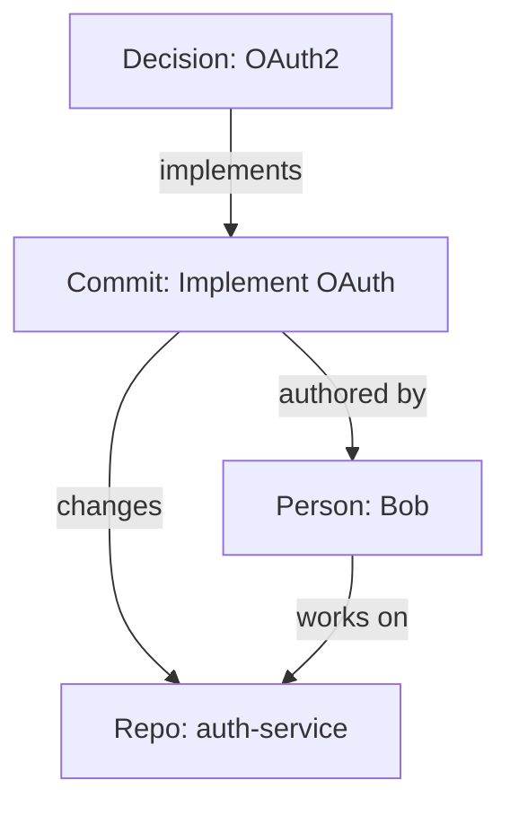
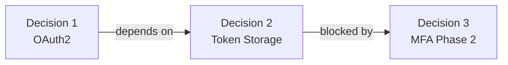
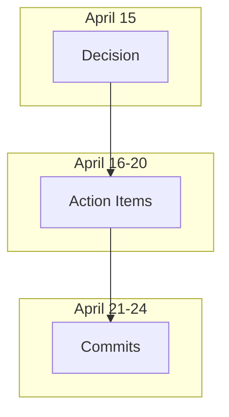

# Especificación Fase 3: Knowledge Graph + Visualización

**Estado:** Planificación  
**Timeline:** 1-2 sprints  
**Dependencias:** Phase 2 completado  
**Scope:** Grafo de conocimiento, visualización, análisis de relaciones

---

## 1. Descripción General

Fase 3 agrega capacidades de visualización que permiten ver relaciones entre decisiones, commits, personas y repos como un grafo de conocimiento interconnectado.

**Problema que resuelve:**
- Difícil ver "big picture" de cómo todo se conecta
- Decisiones aisladas sin contexto de dependencias
- Difícil identificar impacto transversal

**Solución:**
- Grafo de nodos (decisiones, commits, personas, repos, topics)
- Edges (implementa, depende-de, participó, afectó)
- Visualización interactiva (Mermaid, SVG, o salida JSON)

---

## 2. Arquitectura del Knowledge Graph

### 2.1 Tipos de Nodos

```typescript
enum NodeType {
  DECISION = "decision",
  MEETING = "meeting",
  ACTION_ITEM = "action_item",
  COMMIT = "commit",
  PERSON = "person",
  REPO = "repo",
  TOPIC = "topic",
  FILE = "file",
}

interface GraphNode {
  id: string;
  type: NodeType;
  label: string;
  metadata: {
    date?: Date;
    author?: string;
    status?: string;
    [key: string]: any;
  };
  properties: {
    created: Date;
    updated: Date;
    importance: number; // 0-1
  };
}
```

### 2.2 Tipos de Edges

```typescript
enum EdgeType {
  IMPLEMENTS = "implements",           // decision → commit
  DEPENDS_ON = "depends_on",          // decision → decision
  PARTICIPATES = "participates",      // person → meeting
  OWNS = "owns",                       // person → action_item
  AFFECTS = "affects",                 // commit → file
  RELATED_TO = "related_to",          // decision ↔ decision
  TRIGGERED_BY = "triggered_by",      // action_item → commit
  AUTHORED = "authored",               // person → commit
  CHANGES = "changes",                // commit → file
  TAGGED_WITH = "tagged_with",        // node → topic
}

interface GraphEdge {
  id: string;
  source: string;        // node id
  target: string;        // node id
  type: EdgeType;
  weight: number;        // 0-1 (confianza/importancia)
  metadata: {
    date?: Date;
    reason?: string;
    score?: number;
  };
  properties: {
    created: Date;
    updated: Date;
  };
}
```

### 2.3 Estructura Completa

```typescript
interface KnowledgeGraph {
  nodes: Map<string, GraphNode>;
  edges: Map<string, GraphEdge>;
  metadata: {
    created: Date;
    lastUpdated: Date;
    totalNodes: number;
    totalEdges: number;
    timeRange: { from: Date; to: Date };
  };

  // Methods
  addNode(node: GraphNode): void;
  addEdge(edge: GraphEdge): void;
  getNodePath(from: string, to: string): GraphPath[];
  getConnectedNodes(nodeId: string, depth?: number): GraphNode[];
  getImpactAnalysis(nodeId: string): ImpactAnalysis;
  toMermaid(): string;
  toJSON(): object;
  toSVG(): string;
}
```

---

## 3. Construcción Automática del Grafo

### 3.1 Poblamiento Inicial

```
Source de datos:
  ├─ Memory entries (decisiones, reuniones, items)
  ├─ Git commits (repos, autores, cambios)
  ├─ Team members (personas)
  └─ Links Phase 2 (edges automáticas)

Proceso:
  1. Iterate todas las entradas en Memory
  2. Crear nodo para cada decisión, reunión, action item
  3. Crear nodos para personas (de participants/owners)
  4. Crear nodos para repos (de relatedRepos)
  5. Extraer topics (tags) de decisiones/reuniones
  6. Crear edges basado en Memory relationships
  7. Crear edges basado en commit links (Phase 2)
  8. Crear edges basado en participación
```

### 3.2 Actualización Continua

```
Trigger: create_meeting_note, auto_link_commits, etc.

Actualización:
  1. Agregar nuevos nodos para entities nuevas
  2. Agregar edges basado en relaciones nuevas
  3. Recalcular importance scores
  4. Actualizar timestamps
  5. Invalidar cachés
```

---

## 4. Análisis del Grafo

### 4.1 Centralidad

```typescript
interface CentralityMetrics {
  degreeCentrality: number;      // Cuántos edges conectan
  betweennessCentrality: number; // Cuántos shortest paths pasan
  closenessCentrality: number;   // Distancia promedio a otros nodos
  eigenvectorCentrality: number; // Conectado a nodos importantes
}

// Uso: Identificar "hub" decisiones/personas críticas
```

### 4.2 Community Detection

```typescript
interface Community {
  id: string;
  nodes: GraphNode[];
  edges: GraphEdge[];
  topic?: string;
  density: number; // Qué tan conectado está el cluster
  bridges: { node: GraphNode; externalConnections: number }[];
}

// Uso: Ver temas/áreas naturales de agrupación
```

### 4.3 Path Analysis

```typescript
interface PathAnalysis {
  from: GraphNode;
  to: GraphNode;
  shortestPath: GraphNode[];
  distance: number;
  allPaths: GraphNode[][];
  bottlenecks: GraphNode[]; // Nodos críticos en el camino
}

// Uso: "¿Cómo se conecta decision A con decision B?"
```

### 4.4 Impact Analysis

```typescript
interface ImpactAnalysis {
  sourceNode: GraphNode;
  reachableNodes: {
    depth1: GraphNode[];
    depth2: GraphNode[];
    depth3: GraphNode[];
    allReachable: GraphNode[];
  };
  affectedRepos: string[];
  affectedPeople: string[];
  estimatedImpact: number; // 0-1
  timeline: {
    start: Date;
    expectedEnd: Date;
    actualEnd?: Date;
  };
}

// Uso: "¿Quién y qué fue afectado por esta decisión?"
```

---

## 5. Herramientas de Visualización

### 5.1 `get_knowledge_graph`

```
Entrada:
  - timeframe?: "week" | "month" | "all"
  - filters?: {
      nodeTypes: NodeType[]
      minImportance?: number
      repos?: string[]
      people?: string[]
      topics?: string[]
    }
  - format: "json" | "mermaid" | "svg"

Salida:
  - KnowledgeGraph o visualización
```

**Formato Mermaid:**


### 5.2 `analyze_node_impact`

```
Entrada:
  - nodeId: string
  - depth?: number (default: 3)

Salida:
  - ImpactAnalysis completo
```

**Respuesta:**
```json
{
  "sourceNode": { "id": "decision-1", "label": "OAuth2 Decision" },
  "reachableNodes": {
    "depth1": [commits, action_items],
    "depth2": [people, files],
    "depth3": [repos, other_decisions],
    "allReachable": [...]
  },
  "affectedRepos": ["auth-service", "frontend"],
  "affectedPeople": ["Alice", "Bob", "Charlie"],
  "estimatedImpact": 0.85,
  "timeline": {
    "start": "2026-04-15",
    "expectedEnd": "2026-04-25",
    "actualEnd": "2026-04-24"
  }
}
```

### 5.3 `find_communities`

```
Entrada:
  - algorithm?: "louvain" | "girvan-newman"
  - minSize?: number (default: 2)

Salida:
  - Community[] (clusters de nodos relacionados)
```

**Ejemplo:**
```json
{
  "communities": [
    {
      "id": "auth-cluster",
      "topic": "Authentication",
      "nodes": ["OAuth2 Decision", "Token Management", "Session Handling"],
      "density": 0.92,
      "bridges": ["Person: Alice"] // conecta a otros clusters
    },
    {
      "id": "api-cluster",
      "topic": "API Design",
      "nodes": ["API Versioning", "REST Endpoints"],
      "density": 0.78,
      "bridges": ["Repo: backend"]
    }
  ]
}
```

### 5.4 `get_node_path`

```
Entrada:
  - from: nodeId
  - to: nodeId

Salida:
  - Shortest path + alternative paths + analysis
```

**Ejemplo:**
```json
{
  "from": "Alice",
  "to": "Commit abc123",
  "shortestPath": [
    "Alice (person)",
    "Meeting 2026-04-15 (meeting)",
    "OAuth2 Decision (decision)",
    "Commit abc123 (commit)"
  ],
  "distance": 3,
  "bottlenecks": ["OAuth2 Decision"] // nodo crítico
}
```

### 5.5 `get_person_network`

```
Entrada:
  - person: string (nombre)
  - depth?: number

Salida:
  - Subgrafo de la persona y sus conexiones
```

**Ejemplo:**
```json
{
  "person": "Alice",
  "meetings": 12,
  "decisions": 8,
  "actionItems": { "total": 15, "completed": 12, "pending": 3 },
  "collaborators": ["Bob", "Charlie", "Eve"],
  "repos": ["auth-service", "backend", "frontend"],
  "impact": {
    "totalCommitsByTeam": 147,
    "commitsBySelfOrTeam": 87,
    "percentage": 59%
  }
}
```

### 5.6 `get_repo_decision_history`

```
Entrada:
  - repo: string

Salida:
  - Timeline de decisiones que afectaron el repo
```

**Ejemplo:**
```json
{
  "repo": "auth-service",
  "decisions": [
    {
      "date": "2026-04-15",
      "decision": "Use OAuth2 with PKCE",
      "commits": 23,
      "authors": ["Bob", "Alice"],
      "status": "implemented",
      "implementationDays": 9
    }
  ]
}
```

---

## 6. Visualizaciones Propuestas

### 6.1 Mermaid Diagrams

**Tipo 1: Decision Flow**


**Tipo 2: Implementation Timeline**


### 6.2 SVG Graph (Fuerza Dirigida)

- Nodos representados como círculos
- Tamaño = importancia
- Color = tipo de nodo
- Edges = relaciones
- Fuerzas de repulsión/atracción para layout

### 6.3 JSON Structure

Para consumo por herramientas externas (D3.js, vis.js, etc.)

---

## 7. Casos de Uso Phase 3

### Caso 1: "Cuál es el impacto de la decisión OAuth2?"

```
Tool: analyze_node_impact
  nodeId: "decision-oauth2"
  depth: 3

Response:
  - Commits que la implementan: 23
  - Personas involucradas: 3
  - Repos afectados: 2
  - Files modificadas: 47
  - Estimado impacto: 85%
  - Timeline: 9 días (estimado 10)
```

### Caso 2: "Qué decisiones están relacionadas?"

```
Tool: get_knowledge_graph
  format: "mermaid"
  filters:
    nodeTypes: ["decision"]
    topics: ["authentication"]

Response: Mermaid diagram mostrando grafo de decisiones de auth
```

### Caso 3: "Cómo llegó la decisión de OAuth2 a implementarse?"

```
Tool: get_node_path
  from: "Alice"
  to: "Commit abc123"

Response:
  Alice → Meeting → Decision → Commit
  (persona → coordinadora → decisora → implementadora)
```

### Caso 4: "Qué áreas naturales de trabajo emergen?"

```
Tool: find_communities

Response:
  - Auth cluster (OAuth2, Session, Tokens)
  - API cluster (Versioning, Endpoints)
  - Data cluster (Migrations, Schema)
  (cada cluster es una área de trabajo natural)
```

### Caso 5: "Quién es central en el equipo?"

```
Tool: get_person_network
  person: "Alice"

Response:
  - 12 reuniones
  - 8 decisiones clave
  - 15 action items (12 completadas)
  - Colabora con: Bob, Charlie, Eve
  - Impacto en commits: 59%
```

---

## 8. Algoritmos de Análisis

### 8.1 Community Detection (Louvain)

```
Entrada: Grafo completo
Algoritmo: Maximizar modularidad
Salida: Comunidades (clusters)

Idea: Encontrar grupos densamente conectados
```

### 8.2 Centralidad (Múltiples métricas)

```
Degree: Cuántos edges
Betweenness: Cuántos shortest paths
Closeness: Distancia promedio
Eigenvector: Conectado a importantes

Uso: Identificar nodos "hub" críticos
```

### 8.3 Shortest Path (Dijkstra)

```
Entrada: Nodo origen, nodo destino
Algoritmo: Dijkstra modificado para grafos dirigidos
Salida: Camino más corto + alternativas

Uso: Entender cómo se conectan entidades
```

### 8.4 Reachability Analysis

```
Entrada: Nodo origen, profundidad
Algoritmo: BFS hasta depth N
Salida: Todos nodos alcanzables

Uso: Impact analysis
```

---

## 9. Persistencia del Grafo

### 9.1 Reconstrucción Automática

```
Trigger: Cada sesión o cada 1 hora

Proceso:
  1. Limpiar grafo anterior (o incremental)
  2. Cargar todas Memory entries
  3. Crear nodos para cada entidad
  4. Crear edges basado en relationships
  5. Recalcular métricas
  6. Cachear grafo en disco (JSON)
```

### 9.2 Serialización

```typescript
// Guardar
const graphJSON = JSON.stringify({
  nodes: Array.from(graph.nodes.values()),
  edges: Array.from(graph.edges.values()),
  metadata: graph.metadata
});
fs.writeFileSync('graph.json', graphJSON);

// Cargar
const loaded = JSON.parse(fs.readFileSync('graph.json'));
graph = KnowledgeGraph.fromJSON(loaded);
```

---

## 10. UI/UX Considerations

### 10.1 Para Terminal/CLI (Mermaid)

```
Tool output:
  graph TB
    D["Decision"]
    C["Commit"]
    D --> C

Usuario copia/pega en editor de Markdown
```

### 10.2 Para Web (JSON)

```
API devuelve JSON
Frontend (D3.js, vis.js) renderiza grafo interactivo
```

### 10.3 Exportación

```
Formatos soportados:
  - Mermaid (Markdown)
  - JSON (programmatic)
  - SVG (static image)
  - Cypher (Neo4j compatible)
```

---

## 11. Métricas de Éxito Phase 3

- Grafo reconstruible 100% desde Memory
- Community detection > 90% accuracy vs manual review
- Path finding < 100ms para grafos < 1000 nodos
- Visualización renderizable en Markdown
- Impact analysis corect identifying 90% de affected repos

---

## 12. Plan de Implementación

### 12a: Foundation (Semana 1)
- [ ] Definir KnowledgeGraph class
- [ ] Implementar poblamiento desde Memory
- [ ] Crear GraphNode, GraphEdge types

### 12b: Analysis Algorithms (Semana 1-2)
- [ ] Centralidade metrics
- [ ] Community detection
- [ ] Path analysis
- [ ] Impact analysis

### 12c: Visualization (Semana 2)
- [ ] Mermaid generation
- [ ] SVG generation
- [ ] JSON export
- [ ] get_knowledge_graph tool

### 12d: Query Tools (Semana 2-3)
- [ ] analyze_node_impact
- [ ] find_communities
- [ ] get_node_path
- [ ] get_person_network
- [ ] get_repo_decision_history

### 12e: Polish (Semana 3)
- [ ] Tests
- [ ] Performance optimization
- [ ] Documentation
- [ ] Examples

---

## 13. Dependencias Nuevas

- `graphology` (grafo lib)
- `graphology-metrics` (centralidad, etc)
- `graphology-communities-louvain` (community detection)
- `mermaid` (already available)
- (opcional) `cypher-query-language` (si exportamos Neo4j)

---

## 14. Extensiones Futuras

- Integración con Neo4j para grafos grandes
- Visualización 3D (Three.js)
- Real-time collaboration en grafo
- ML para auto-tagging de nodos
- Recomendaciones basadas en similar patterns
